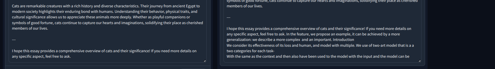

---

### Extending GPT-2 Context Length via RoPE Scaling

#### Training Runs
- [Training Run 1 on WandB](https://wandb.ai/dumbal/huggingface/runs/omafkp4r?nw=nwuserdumbal)
- [Training Run 2 on WandB](https://wandb.ai/dumbal/huggingface/runs/pivwo4nb?nw=nwuserdumbal)

#### Demo
- Try the model here: [GPT-2 Long Demo](https://huggingface.co/spaces/archit11/gpt2long)

#### Evaluation
- Not as good as expected: [RoPE Test Evaluation](https://github.com/kaiokendev/cutoff-len-is-context-len/blob/main/rope_test.ipynb)
 but...good enough! given the compute constrians! :D  

### Approach
- Use the rotatory pos implementation by lucid rains [here](https://github.com/lucidrains/rotary-embedding-torch)
- change the model to use rope pos embeddings 
- save and upload to huggingface (to not oom)
- load and train seperately on [long-alpaca12k](https://huggingface.co/datasets/Yukang/LongAlpaca-12k) 
- these steps can be seen in [notebook](./final.ipynb) and [notebook](./gpt2long-train.ipynb) 
- for logs and other findings or docs check [logs](./pretier_log.md) and [this](./pretier_documentation.md)
---

